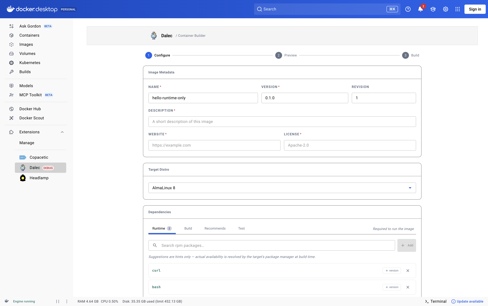
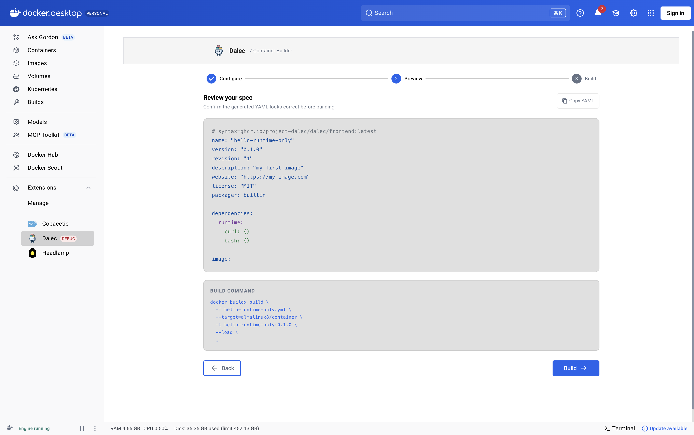
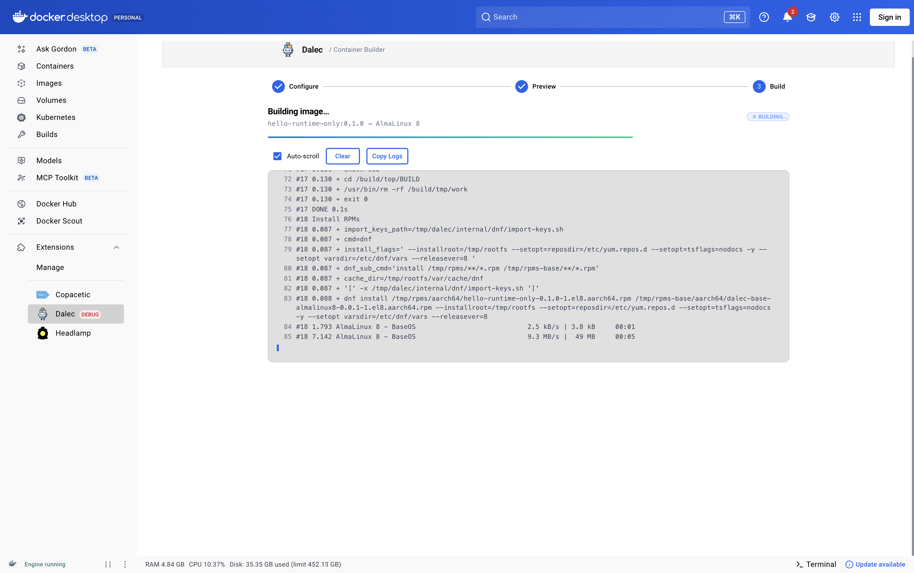
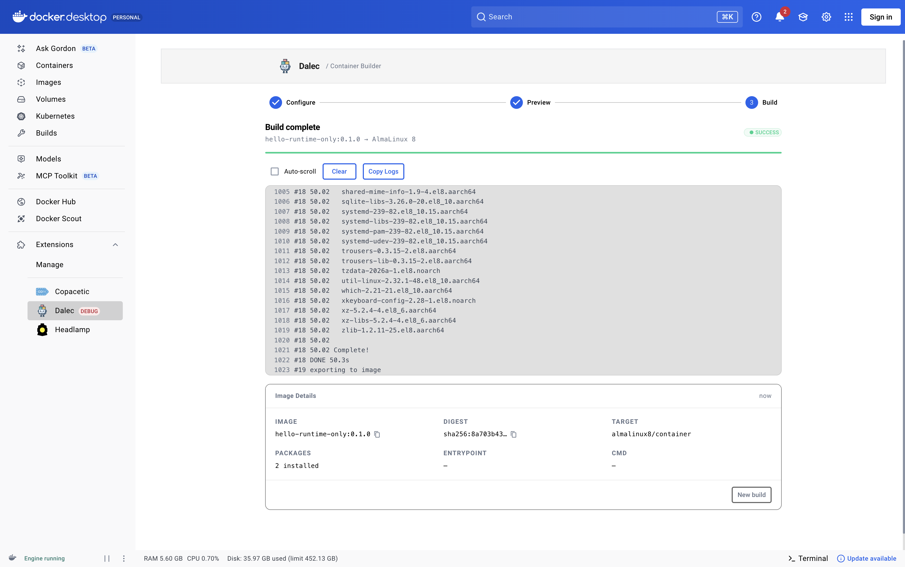

# Dalec Docker Desktop Extension

A Docker Desktop extension that builds minimal container images using the [Dalec](https://github.com/project-dalec/dalec) BuildKit frontend. Pick an OS target, select the packages you need, preview the generated Dalec spec, and build — all from a single tab inside Docker Desktop.

> [!WARNING]
> **Alpha** — interfaces and behavior may change between versions. Not yet published to the Docker Marketplace; install from source.

---

## What it does

- Select a Dalec build target (Azure Linux, Mariner, AlmaLinux, Rocky, Debian, Ubuntu, Fedora, openSUSE, Windows cross)
- Pick packages across four dependency scopes (`runtime`, `build`, `recommends`, `test`) with optional version constraints
- Configure image metadata (name, version, description, license, entrypoint, cmd, workdir, user, env vars, labels)
- Preview the generated Dalec YAML spec and the exact `docker build` command
- Run the build and stream logs back into the UI
- Copy the image name, digest, or the generated spec with one click

---

## Prerequisites

- Docker Desktop 4.8+ with the extensions framework enabled
- BuildKit (bundled with recent Docker Desktop releases — no extra setup)
- On first build, Docker will pull the Dalec frontend image from `ghcr.io/project-dalec/dalec/frontend:latest`

---

## Install

Until the extension is published to the Marketplace, install from source:

```bash
git clone https://github.com/project-dalec/dalec-docker-desktop-extension
cd dalec-docker-desktop-extension
make install-extension
```

This builds `dalec/dalec-docker-extension:latest` and installs it into Docker Desktop. Open Docker Desktop — a **Dalec** tab appears in the left sidebar.

To update after pulling changes:

```bash
make update-extension
```

To remove:

```bash
docker extension rm dalec/dalec-docker-extension:latest
```

---

## Usage

The UI is a three-step flow.

### 1. Configure

Choose an OS target, add packages to the relevant dependency scopes (`runtime` / `build` / `recommends` / `test`), and fill in image metadata (name, version, license, entrypoint, cmd, and so on). Fields show example placeholders where defaults are ambiguous.



### 2. Preview

Review the generated Dalec YAML and the `docker build` command that will be run. Editing is not in-place; go back to step 1 to change anything.



### 3. Build

Logs stream live while the build runs.



On success, the Image Details card shows the image name, digest, target, and package count, with copy buttons and a "New build" shortcut.



After a successful build the image exists in your local Docker daemon — use it with `docker run`, `docker inspect`, or push it to a registry like any other image.

---

## Supported OS targets

Targets are fetched dynamically from the Dalec frontend at runtime. If that call fails, the UI falls back to this list:

| Family | Targets |
|---|---|
| RPM | Azure Linux 3, CBL-Mariner 2, AlmaLinux 8/9, Rocky Linux 8/9, Fedora 40, openSUSE Leap 15.5 |
| Debian/Ubuntu | Debian Bullseye/Bookworm/Trixie, Ubuntu Bionic/Focal/Jammy/Noble |
| Windows | `windowscross` |

---

## Development

### Repo layout

```
backend/   Express + TypeScript service that runs inside the extension VM and shells out to docker
ui/        React + MUI frontend served by Docker Desktop
docs/      ARCHITECTURE, TESTING, DEBUGGING
Dockerfile Multi-stage build for the extension image
Makefile   Build / install / update / push / test targets
```

### Rebuild after changes

The UI talks to the backend through `ddClient` from `@docker/extension-api-client`, which is only injected inside Docker Desktop's extension iframe. That means a standalone Vite dev server won't work — any change (frontend or backend) requires rebuilding and reinstalling the extension:

```bash
make update-extension
```

To open Chrome DevTools for the extension panel:

```bash
docker extension dev debug dalec/dalec-docker-extension:latest
```

To stop auto-opening DevTools:

```bash
docker extension dev reset dalec/dalec-docker-extension:latest
```

### Tests

```bash
make test            # runs backend + UI unit tests
```

Type-checking separately:

```bash
cd ui && npm run typecheck
cd backend && npx tsc --noEmit
```

---

## Architecture

High level: the UI talks to the backend over the extension framework's `ddClient` (no host network exposure); the backend validates the payload, writes the generated spec into a temp directory, and spawns `docker build` with `DOCKER_BUILDKIT=1`. Logs are buffered per build and pulled by the UI via HTTP polling against `/api/build/:id/status`. Build records expire 10 minutes after completion.

For a deeper walkthrough see [docs/ARCHITECTURE.md](./docs/ARCHITECTURE.md). For debugging tips see [docs/DEBUGGING.md](./docs/DEBUGGING.md).

---

## Related

- [Dalec](https://github.com/project-dalec/dalec) — the BuildKit frontend this extension drives
- [Docker Extensions SDK](https://docs.docker.com/desktop/extensions-sdk/)
- [BuildKit](https://github.com/moby/buildkit)

## License

[Apache 2.0](./LICENSE)
